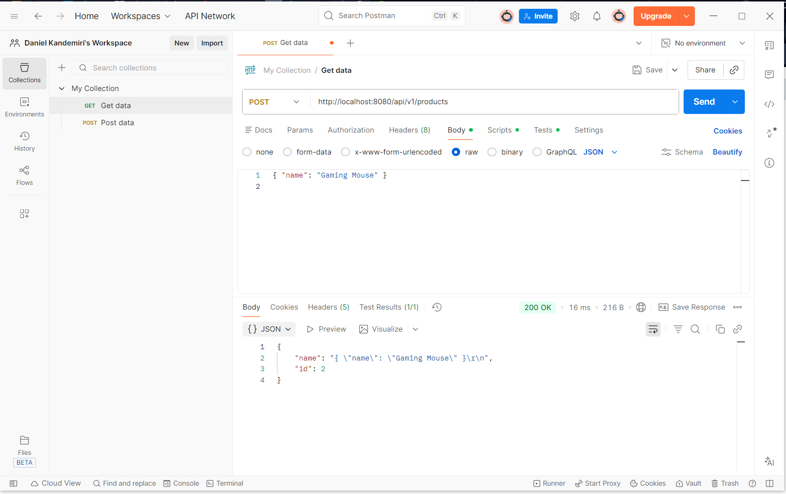
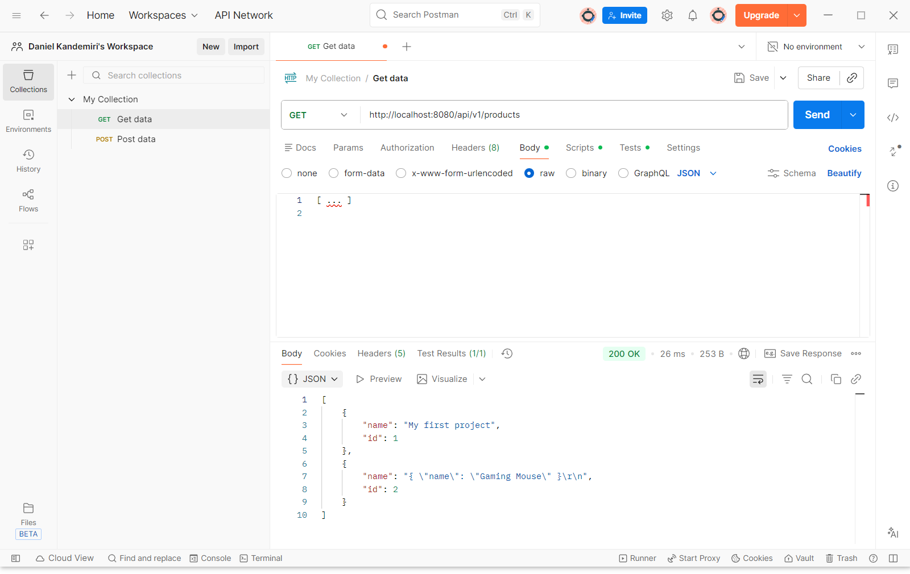
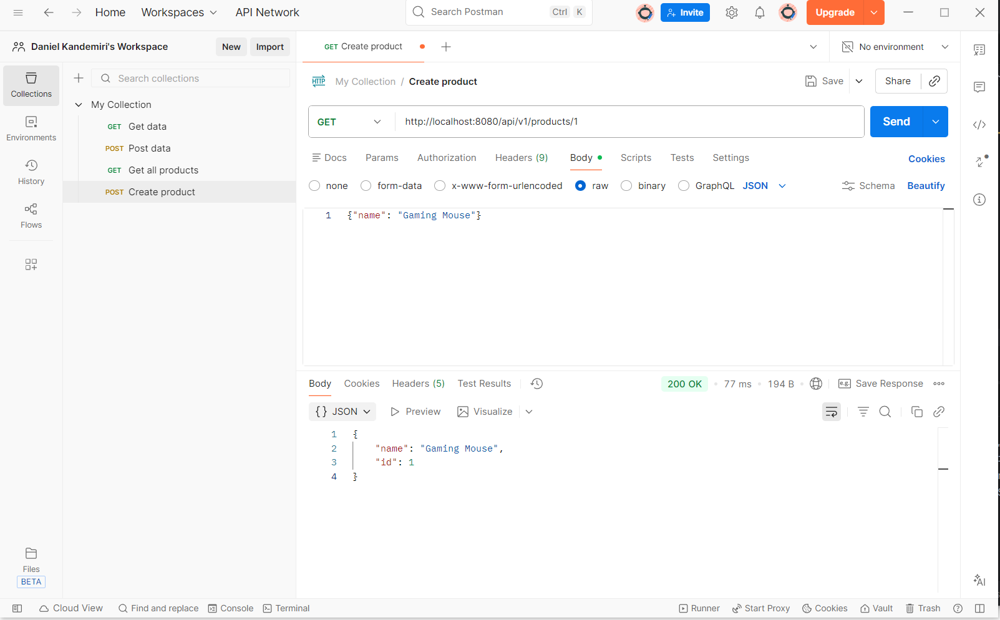
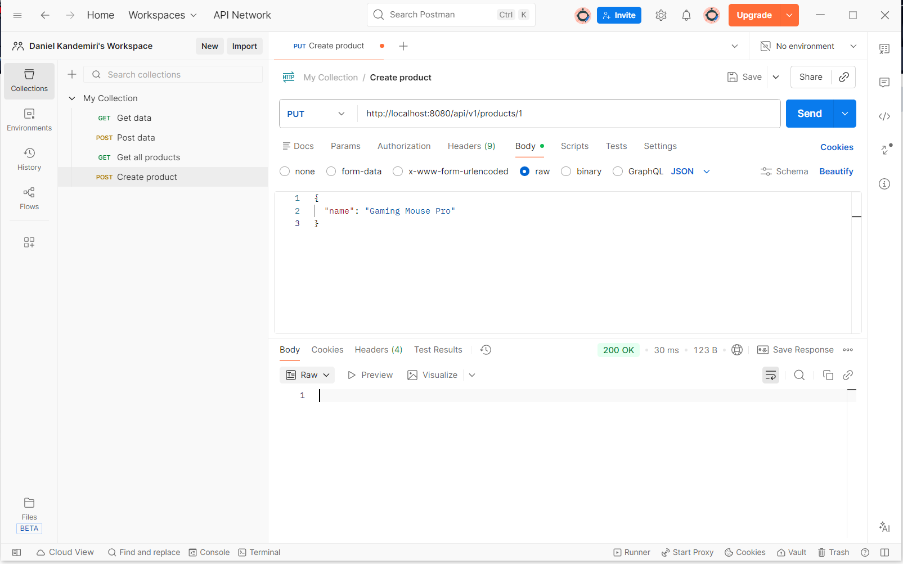
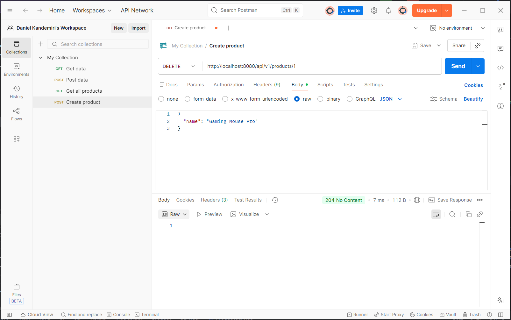
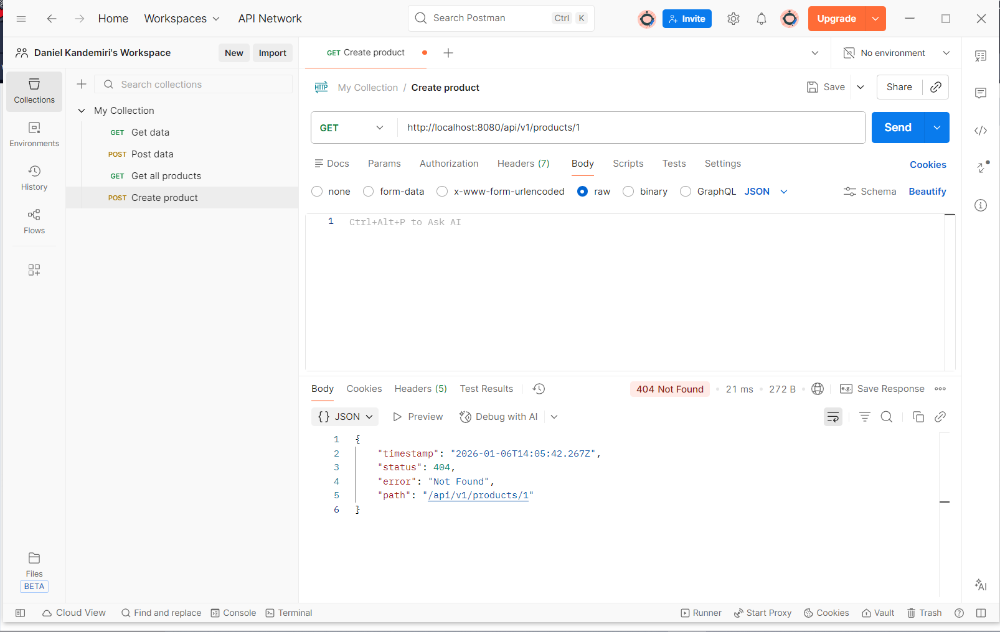
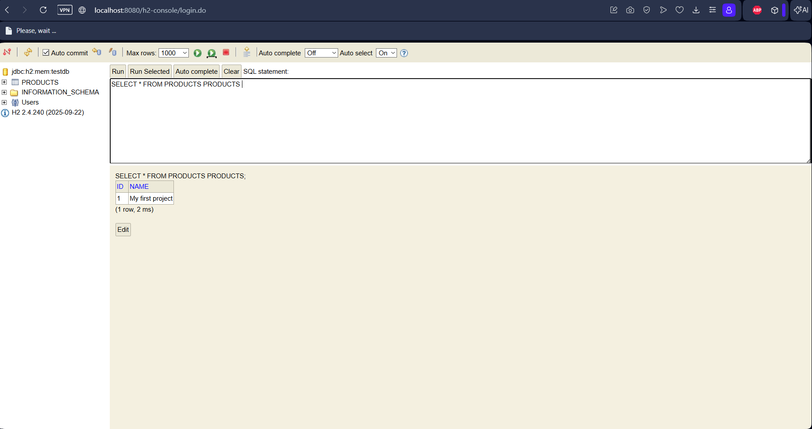

# Project 2: Spring Boot REST API
This project demonstrates a RESTful API for managing products using Spring Boot and H2 Database.

## 🛠 Tech Stack
* **Java 25** & **Spring Boot 4.0.1**
* **H2 Database** (In-Memory)
* **Postman** (API Testing)

---

## 🚀 API Use Cases & Screenshots

### 1. Create Resource (POST)
**Endpoint:** `POST /api/v1/products`

### 2. Get All Resources (GET ALL)
**Endpoint:** `GET /api/v1/products`

### 3. Get Specific Resource (GET by ID)
**Endpoint:** `GET /api/v1/products/1`

### 4. Update Resource (PUT)
**Endpoint:** `PUT /api/v1/products/1`

### 5. Delete Resource (DELETE)
**Endpoint:** `DELETE /api/v1/products/1`

### 6. Exception Handling (404 Error)
**Endpoint:** `GET /api/v1/products/999`

---

## 📊 Database Verification (H2 Console)
**URL:** `http://localhost:8080/h2-console`
